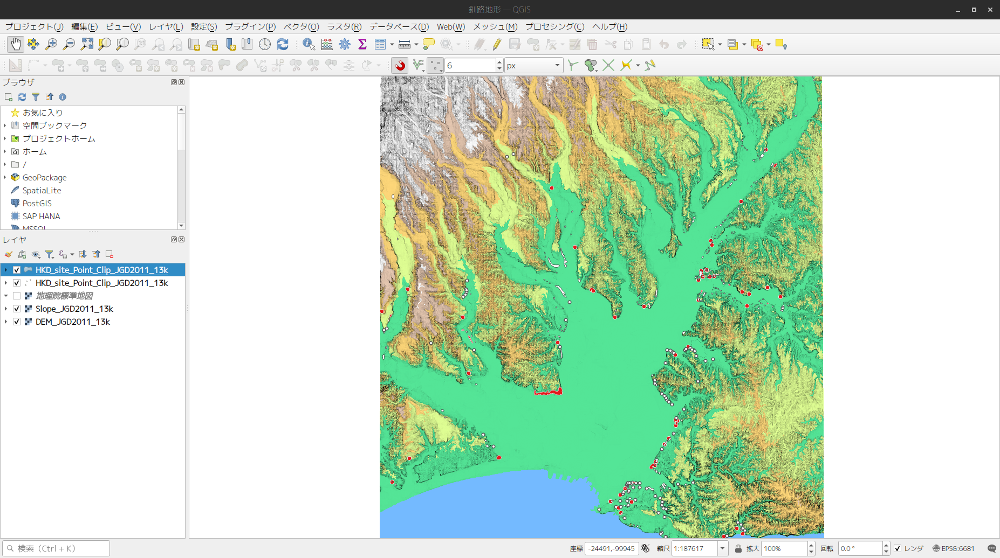
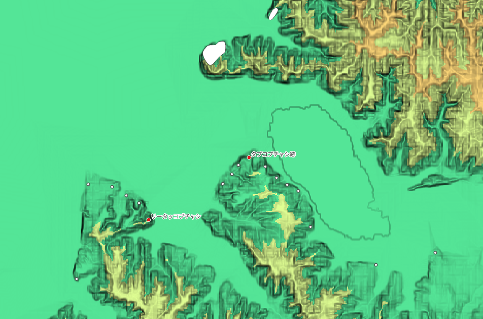

# 使い方

1. QGISをインストールしたパソコンを用意してください。
2. QGIS→釧路地形.qgzを開いてください。
3. 釧路の地形データが表示されます。

# データの説明

釧路平野の地形及び遺跡位置データを表示しています。

背景図は基盤地図情報数値標高モデル10mメッシュのDEMデータと、DEMを元に作成した傾斜量ラスタを重ねています。

遺跡データは北海道教育委員会の包蔵地データを使用しています。デフォルトの表示は「アイヌ文化期」に属する遺跡を赤く表示して、遺跡名を付しています。遺跡名は5万分1以上の縮尺で表示されます。

